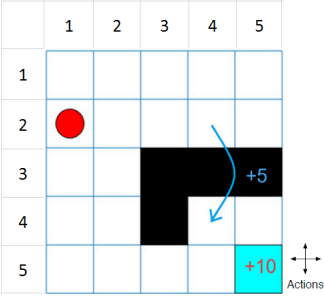
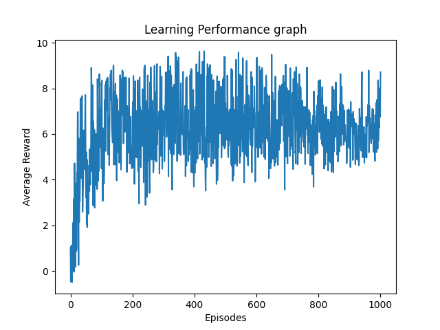
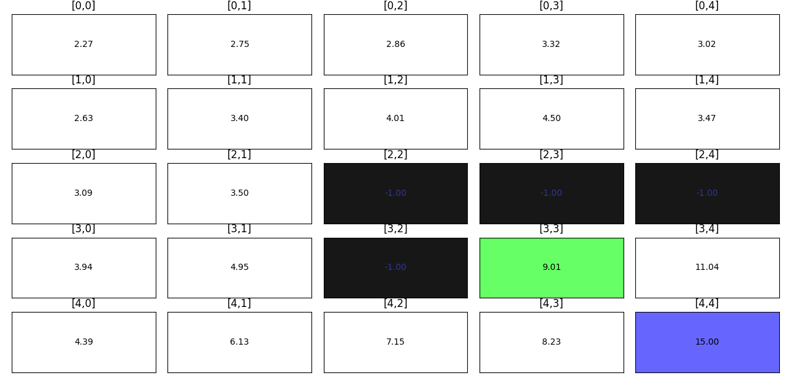

# Q-Learning-A-Solution-for-Grid-World-Problem
In this work, the grid world problem will be solved using the model-free reinforcement learning method known as the Q-Learning algorithm.

### Problem Description 

In this context, an agent learns to accomplish a mission through movement and a few unique tasks in a grid world environment. The figure depicts the task's general outline. In a 5x5 grid environment, the agent is positioned on the (2,1) start cell at the start of first episode. The network then gets the agent state inputs 𝑢t at each step, and produces an output vectors of action values, 𝑧t= [𝑄1t,𝑄2t,𝑄3t,𝑄4t ]T whose elements are corresponding to four acts "go north," "go east," "go south," and "go west" respectively. In addition, there is a special action that "jumps" from (2,4) to (4,4) and receives a +5 reward. The agent will receive an additional +10 reward when it reaches the end location (5,5) or the win state. All other grid movements, however, will receive a -1 reward. The agent will encounter some barriers in the grid environment. We can apply q-learning approaches to solve the grid world problem.

Install necessory packages by running the below lines in the terminal. 

`pip install numpy`

`pip install pandas`

`pip install matplotlib`

`pip install openpyxl`

To run the code, 

`python grid_world_stoch_main.py`

### Algorithm and Explanation

Rows, columns, the black grid, start position, and other useful variables are declared at the start of the Python code. The algorithms are called "Grid_Agent" and "Grid­_State" are written in the Python "Class" function. The function _init_ of the Grid_State class uses the NumPy module to create a grid with rows and columns. By assigning values, it initialises the start, isend, and determine variables. The code can run stochastically if the determine variable is set to False. Additionally, the _init_ function in the Grid_Agent initialised the states, actions, initial Q-values, learning rate, exp rate, and gamma value. Actions contains the strings south, north, west, and east is a list of things the agent can do. Q-values is a dictionary of dictionaries and initialised with ‘-1’ to get ‘-1’ reward for all other actions. In order to ensure that every action receives a ‘–1’ reward, the max_nxt_reward setting in Q-values has been set to ‘-1’ as well. The learning rate, which ranges from 0 to 1, determines how quickly the deep learning model learns new information. Because it is straightforward and efficient, learning rate is a common deep learning technique. After learning a good approximation, using a low learning learning rate aids in fine-tuning the model. In the start of training, a relatively high learning rate is needed to learn quickly. The initial random action from the actions list is chosen using the exp_rate term. Later, the exploration function will receive the selected action. The discount factor described in section II, known as the gamma value, is set at a high value to prioritise future rewards over immediate rewards.

The train function is the core part of the Python code implementation, which accepts the episode value as an argument and loops until it reaches the maximum episode or stops if the early stopping condition is met. Here, 1000 episodes were employed instead of 100 because the agent was taught more by raising the episode value and it did not converge inside the 100 episodes. If and else loops, which are used to invoke other functions in the code, are contained within the while loop. Actions are made using the loop else in the grid world. The action based on the epsilon greedy or a random action is returned by the chooseAction function in the else loop. Epsilon greedy will be used more frequently if exp_rate is lower; else, random action selection will be used. The best action will be selected from among all those in the epsilon greedy action selection process based on the maximum next reward. When performing the action in the grid, the function takeAction is utilised to update the next position to the current state. The takeAction function will call the next_cell_pos function and return the next position. Because of the determine flag is set to False, the next_cell_pos function will move to the else case and execute the non-deterministic condition. The action is then selected based on the probability values in the following phase, which calls the epsilon_greedy_prob function. While the high probability value permits the agent to execute the same action, it also permits the agent to take alternate actions with lower probabilities. Here is how the code that performs the action uses the epsilon greedy exploration strategy. Using the function isEndFunc, the code will determine whether the agent has reached the win state or not after each action. If the value of isEndFunc is True, code will be inserted into the while loop's if loop. The getReward function will be called inside the if loop to begin the back propagation. If an agent uses the jump path to reach the win state, it will receive a +5 jump reward and a +10 win reward; otherwise, it will only receive the +10 win reward. This has been accomplished by determining whether the agent took the action south through the state of  or not. We used the bellman’s equation mentioned in section IV and values of learning rate, gamma, current q-value, and reward to calculate each step reward during the back propagation. The cumulative reward was computed by adding all the rewards from a given episode, and the average cumulative reward was calculated by dividing the cumulative reward by the total number of action states in that episode.

We incorporated an early termination condition based on the average cumulative reward to prevent overfitting. We used the early stopping condition 30 consecutive average cumulative rewards of greater than 5 instead of 30 consecutive average cumulative rewards of greater than 10.  The cum_itr_list 30 most recent values in a series are all bigger than 5 the code will change the value of cum_itr to True, break the while loop, and end the episodes. The learning performance graph was created using the library matplotlib by plotting a graph between the episode and cumulative average reward. A q-table with four actions south, north, west, east, and agent travelled states was created using the gen_qtable function. Q-values were loaded into a data frame in pandas, translated to a table format using pandas’ operations, and then saved as an excel sheet using the openpyxl module. The board layout and state data for each grid cell are displayed using the function showGridboard. The agent's travel path or converging direction to the end state is assumed to be represented by the maximum q-value of a given state.

